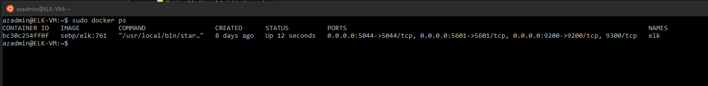

## Automated ELK Stack Deployment

The files in this repository were used to configure the network depicted below.

These files have been tested and used to generate a live ELK deployment on Azure. They can be used to either recreate the entire deployment pictured above. Alternatively, select portions of the filebeat-playbook.yml file may be used to install only certain pieces of it, such as Filebeat.

  - [Filebeat.yml file](Ansible/filebeat-playbook.yml)

This document contains the following details:
- Description of the Topology
- Access Policies
- ELK Configuration
  - Beats in Use
  - Machines Being Monitored
- How to Use the Ansible Build

### Description of the Topology

The main purpose of this network is to expose a load-balanced and monitored instance of DVWA, the D*mn Vulnerable Web Application.

Load balancing ensures that the application will be highly available, in addition to restricting access to the network.
- The load balancers protect the availability of resource by blocking DDOS attacks from outside intrusion. The jump box is a staging or access point to the resources in the network and vms from internet.

Integrating an ELK server allows users to easily monitor the vulnerable VMs for changes to the data and system logs.
- Filebeats watch for the system log files.
- Metricbeat records OS and services running on a server.

The configuration details of each machine may be found below.

| Name     | Function   | IP Address | Operating System |
|----------|------------|------------|------------------|
| Jump Box | Gateway    | 10.0.0.9   | Linux            |
| Web-1    | Webserver  | 10.0.0.8   | Linux            |
| Web-2    | Webserver  | 10.0.0.6   | Linux            |
| Web-3    | Webserver  | 10.0.0.11  | Linux            |
| ELK      | Monitoring | 10.1.0.4   | Linux            |

### Access Policies

The machines on the internal network are not exposed to the public Internet. 

Only the Jump Box machine can accept connections from the Internet. Access to this machine is only allowed from the following IP addresses:
- myip_118.122

Machines within the network can only be accessed by the Jump Box Ansible Docker.
- The Jump Box machine has access to the ELK VM with the IP address 10.0.0.9.

A summary of the access policies in place can be found in the table below.

| Name     | Publicly Accessible | Allowed IP Addresses |
|----------|---------------------|----------------------|
| Jump Box | Yes                 | myip_118.122         |
| Web-1    | No                  | 10.0.0.9             |
| Web-2    | No                  | 10.0.0.9             |
| Web-3    | No                  | 10.0.0.9             |
| ELK      | No                  | 10.0.0.9             |

### Elk Configuration

Ansible was used to automate configuration of the ELK machine. No configuration was performed manually, which is advantageous because ansible can manage multiple machines/vm at once with it's configuration file.

The playbook implements the following tasks:

- Installation of Docker, Python, pip
- Download Images
- System Administration

The following screenshot displays the result of running `docker ps` after successfully configuring the ELK instance.

### Target Machines & Beats
This ELK server is configured to monitor the following machines:
- 10.0.0.6
- 10.0.0.8
- 10.0.0.11

We have installed the following Beats on these machines:
- filebeat
- metricbeat

These Beats allow us to collect the following information from each machine:
- The filebeat allow us to collect the web log information from the machines. Eg. It collects the web traffic patterns.
- The metricbeat collects the OS and services data from the ELK machine.

### Using the Playbook
In order to use the playbook, you will need to have an Ansible control node already configured. Assuming you have such a control node provisioned: 

SSH into the control node and follow the steps below:
- Copy the /etc/ansible/files/filebeat-config.yml file to /etc/filebeat/filebeat.yml.
- Update the /etc/filebeat/filebeat.yml file to include the host ip, the user name and password.
- Run the playbook, and navigate to elk public ip address to check that the installation worked as expected.

_ The user will need to run to download the playbook, update the files, etc._

- update the files: $nano /etc/ansible/files/filebeat-playbook.yml
- run playbooks: $ansible-playbook /etc/ansible/files/filebeat-playbook.yml